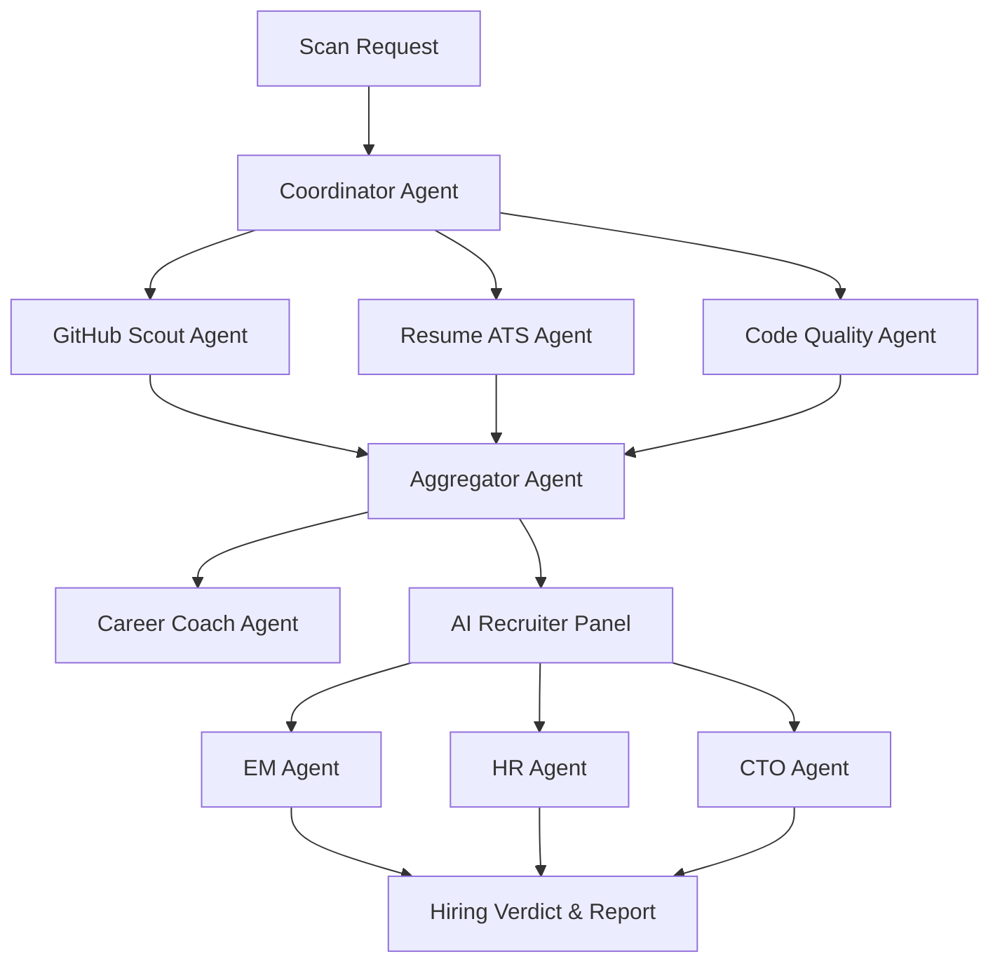

# AI & Machine Learning Architecture — DevScope AI

DevScope AI leverages a hybrid architecture combining LLM Multi-Agent systems (LangGraph / LangChain) and traditional Machine Learning pipelines (Scikit-Learn / XGBoost).

---

## 1. Multi-Agent Orchestration (LangGraph Flow)

The multi-agent coordinator acts as a central router that delegates analysis to specialized domain agents, aggregates findings, and produces the final executive reports.



### Agent Definitions & Tools
1. **GitHub Scout Agent**:
   * **Role**: Parses metadata of public repositories, evaluates contribution graph metrics, and detects project language splits.
   * **Tools**: GitHub REST API client, Git log summary parser.
2. **Resume ATS Agent**:
   * **Role**: Parses resume PDF/DOCX structure, computes keyword density, and checks structure layouts.
   * **Tools**: PyPDF text extractor, Sentence-Transformers semantic matcher.
3. **Code Quality Agent**:
   * **Role**: Deep-scans sample repositories for test coverage, container configuration, and documentation depth.
   * **Tools**: PyAST (Python Abstract Syntax Tree analyzer), Regex-based linters.
4. **AI Recruiter Panel**:
   * **Role**: Multi-agent simulation rendering final verdicts. Evaluates cultural matches (HR), architectural design maturity (CTO), and day-to-day coding practices (EM).
   * **Tools**: Prompt templates representing specific personas.

---

## 2. Machine Learning Predictive Pipeline

To deliver objective, data-driven insights rather than just LLM impressions, DevScope AI runs two dedicated ML models using standard Python ML libraries:

```
Developer Vector
[ github_score, resume_score, experience_years, skill_match_ratio, repo_count ]
       │
       ├─► [ XGBoost Regressor ] ──────► Predicted Salary ($)
       │
       └─► [ RandomForest Classifier ] ─► Hiring Probability (%)
```

### A. Hiring Probability Model
* **Model Class**: `RandomForestClassifier` (Scikit-Learn).
* **Inputs**:
  * `github_score` (Continuous: 0 to 100)
  * `resume_score` (Continuous: 0 to 100)
  * `experience_years` (Continuous: 0 to 40)
  * `skill_match_ratio` (Continuous: 0.0 to 1.0)
  * `project_quality_score` (Continuous: 0 to 100)
* **Outputs**: Probability of target category `1` (Hired/Strong Offer) between `0.0` and `1.0`.

### B. Salary Benchmarking Model
* **Model Class**: `XGBoostRegressor` / `LinearRegression` (Scikit-Learn).
* **Inputs**:
  * `target_role` (One-hot encoded)
  * `experience_years` (Integer)
  * `skill_count` (Integer)
  * `overall_score` (Continuous: Average of GitHub + Resume scores)
* **Outputs**: Predicted baseline annual salary in USD.

---

## 3. Training & Inference Workflow

1. **Preprocessing**: Missing fields are handled with SimpleImputer (median values). Numerical variables are scaled using StandardScaler. Categorical inputs (like Target Role) are encoded using OneHotEncoder.
2. **Offline Training**:
   * A script (`train_models.py`) trains both the classifier and the regressor using historical public resume benchmarks and synthetic test datasets.
   * Models are stored locally as serialized files (`.joblib` format) for rapid, CPU-based loading during inference.
3. **Real-time Inference**:
   * During backend execution, profile metrics are sent to the trained models to estimate salary and hiring probability.
   * If model files are missing, the system uses a fallback calculator based on scoring equations to maintain continuous operations.
