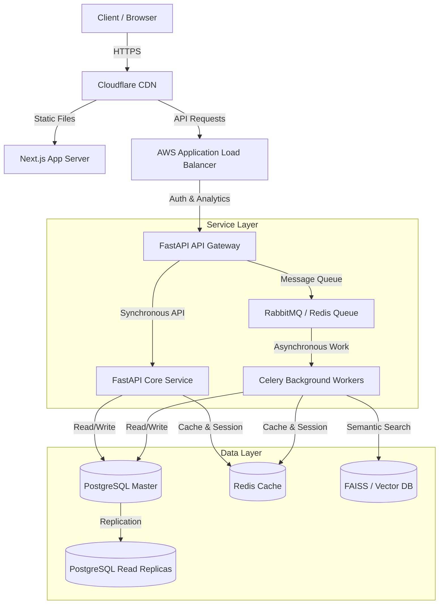
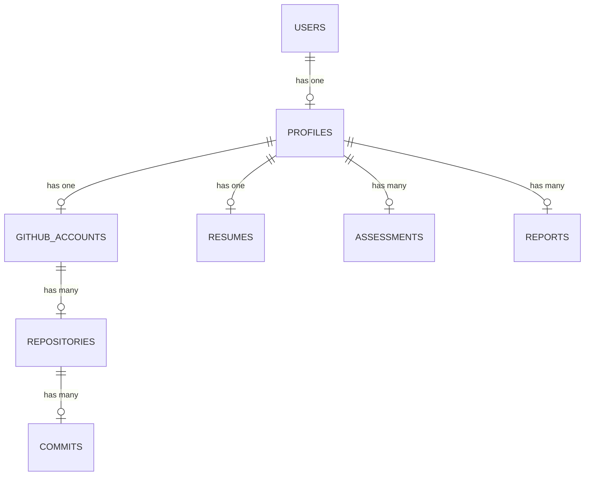

# System Design & Architecture — DevScope AI

## 1. High-Level Architecture



---

## 2. Database Schema (PostgreSQL DDL)



Below is the complete database DDL schema representing an enterprise-grade multi-tenant architecture with support for billing and auditing:

```sql
-- Enable UUID extension
CREATE EXTENSION IF NOT EXISTS "uuid-ossp";

-- 1. Users Table
CREATE TABLE users (
    id UUID PRIMARY KEY DEFAULT uuid_generate_v4(),
    email VARCHAR(255) UNIQUE NOT NULL,
    hashed_password VARCHAR(255) NOT NULL,
    full_name VARCHAR(100),
    is_active BOOLEAN DEFAULT TRUE,
    is_superuser BOOLEAN DEFAULT FALSE,
    created_at TIMESTAMP WITH TIME ZONE DEFAULT CURRENT_TIMESTAMP,
    updated_at TIMESTAMP WITH TIME ZONE DEFAULT CURRENT_TIMESTAMP
);

-- 2. Organizations Table (Multi-tenant SaaS support)
CREATE TABLE organizations (
    id UUID PRIMARY KEY DEFAULT uuid_generate_v4(),
    name VARCHAR(255) NOT NULL,
    owner_id UUID REFERENCES users(id) ON DELETE RESTRICT,
    subscription_tier VARCHAR(50) DEFAULT 'free',
    stripe_customer_id VARCHAR(255),
    created_at TIMESTAMP WITH TIME ZONE DEFAULT CURRENT_TIMESTAMP
);

-- 3. Profiles Table
CREATE TABLE profiles (
    id UUID PRIMARY KEY DEFAULT uuid_generate_v4(),
    user_id UUID UNIQUE REFERENCES users(id) ON DELETE CASCADE,
    target_role VARCHAR(100) DEFAULT 'Full Stack Engineer',
    current_experience_years INT DEFAULT 0,
    skills_list TEXT[],
    created_at TIMESTAMP WITH TIME ZONE DEFAULT CURRENT_TIMESTAMP,
    updated_at TIMESTAMP WITH TIME ZONE DEFAULT CURRENT_TIMESTAMP
);

-- 4. GitHub Accounts Table
CREATE TABLE github_accounts (
    id UUID PRIMARY KEY DEFAULT uuid_generate_v4(),
    profile_id UUID UNIQUE REFERENCES profiles(id) ON DELETE CASCADE,
    username VARCHAR(100) UNIQUE NOT NULL,
    avatar_url VARCHAR(500),
    public_repos INT DEFAULT 0,
    followers INT DEFAULT 0,
    following INT DEFAULT 0,
    github_score INT DEFAULT 0,
    last_scanned TIMESTAMP WITH TIME ZONE
);

-- 5. Repositories Table
CREATE TABLE repositories (
    id UUID PRIMARY KEY DEFAULT uuid_generate_v4(),
    github_account_id UUID REFERENCES github_accounts(id) ON DELETE CASCADE,
    name VARCHAR(255) NOT NULL,
    html_url VARCHAR(500),
    description TEXT,
    stargazers_count INT DEFAULT 0,
    forks_count INT DEFAULT 0,
    primary_language VARCHAR(50),
    code_quality_score INT DEFAULT 0,
    documentation_score INT DEFAULT 0,
    architecture_score INT DEFAULT 0,
    security_score INT DEFAULT 0
);

-- 6. Resumes Table
CREATE TABLE resumes (
    id UUID PRIMARY KEY DEFAULT uuid_generate_v4(),
    profile_id UUID UNIQUE REFERENCES profiles(id) ON DELETE CASCADE,
    file_path VARCHAR(500) NOT NULL,
    ats_score INT DEFAULT 0,
    resume_quality_score INT DEFAULT 0,
    extracted_text TEXT,
    structured_data JSONB,
    created_at TIMESTAMP WITH TIME ZONE DEFAULT CURRENT_TIMESTAMP
);

-- 7. Assessments & Reports
CREATE TABLE reports (
    id UUID PRIMARY KEY DEFAULT uuid_generate_v4(),
    profile_id UUID REFERENCES profiles(id) ON DELETE CASCADE,
    overall_score INT NOT NULL,
    hiring_probability FLOAT NOT NULL,
    predicted_salary DECIMAL(12, 2),
    strengths TEXT[],
    weaknesses TEXT[],
    roadmap JSONB,
    created_at TIMESTAMP WITH TIME ZONE DEFAULT CURRENT_TIMESTAMP
);

-- 8. Audit Logs Table
CREATE TABLE audit_logs (
    id UUID PRIMARY KEY DEFAULT uuid_generate_v4(),
    user_id UUID REFERENCES users(id) ON DELETE SET NULL,
    action VARCHAR(100) NOT NULL,
    ip_address VARCHAR(45),
    details JSONB,
    created_at TIMESTAMP WITH TIME ZONE DEFAULT CURRENT_TIMESTAMP
);

-- Indexes for performance Optimization
CREATE INDEX idx_users_email ON users(email);
CREATE INDEX idx_github_accounts_username ON github_accounts(username);
CREATE INDEX idx_repositories_account_id ON repositories(github_account_id);
CREATE INDEX idx_reports_profile_id ON reports(profile_id);
```

---

## 3. Database Caching & Read Replica Strategy

### Redis Caching Strategy
* **Read-Through Cache Pattern**: Profile dashboards will query Redis first. If there's a cache miss, data will be read from PostgreSQL and written to Redis with a TTL of 1 hour.
* **Cache Invalidation**: Triggered whenever a new resume is uploaded, a GitHub account is re-scanned, or an interview is completed.

### Read Replicas
* **Write Target**: All database writes (resume uploads, user signup, test submissions) route to the Primary PostgreSQL instance.
* **Read Target**: Read requests (dashboard views, analytics history, roadmaps) are load-balanced across multiple PostgreSQL Read Replicas.

---

## 4. Security Architecture

* **Authentication & Authorization**: JWT tokens signed using asymmetric key cryptography (RS256). OAuth2 handles secure GitHub/Google signup.
* **Role-Based Access Control (RBAC)**: Supports roles (`student`, `engineer`, `recruiter`, `admin`) to limit access to target routes and data.
* **Data Encryption**:
  * **In Transit**: Mandatory TLS 1.3 encryption for all user interactions.
  * **At Rest**: AES-256 block encryption for PDFs and storage buckets.
* **Rate Limiting**: IP and Token-based throttling configured on the Gateway layer (using Redis token bucket algorithm) allowing a maximum of 100 API calls/minute per user.

---

## 5. Scaling Strategy for 10 Million Users

1. **Database Partitioning**:
   * Partition the `audit_logs` and `reports` tables by range (monthly partition key) to keep indices compact and accelerate queries.
2. **Stateless App Servers**:
   * Keep FastAPI and Next.js entirely stateless, storing sessions in Redis, permitting horizontal scaling under AWS ECS or Kubernetes Horizontal Pod Autoscaler (HPA) using CPU/Memory metrics.
3. **Queue-Backed Offloading**:
   * Scrapes, PDF parsing, and heavy LLM agent workflows are fully asynchronous. The API routes return `202 Accepted` and offload tasks to RabbitMQ/Celery workers.
4. **CDN and Cache Layering**:
   * Serve all Next.js static bundles and static assets via Cloudflare. Cache common API queries (e.g., market salary trends) globally using edge caching.
